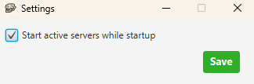

# Mock Server

**Mock Server** is a free, cross-platform desktop app for **local API testing**. Run lightweight **mock servers** on your machine so you can develop and test clients without hitting a real backend. Need a **dummy server** or stand-in HTTP endpoint? Mock Server lets you define routes, status codes, headers, cookies, and delays—then start and stop servers from a simple JavaFX GUI.

---

## Table of contents

- [About Mock Server](#about-mock-server)
- [Who is this for?](#who-is-this-for)
- [Features](#features)
- [Download](#download)
- [How to use Mock Server](#how-to-use-mock-server)
- [FAQ](#faq)

---

## About Mock Server

The **Mock Server** application helps you test software locally by creating servers that imitate a real API. You can run **multiple mock servers on different ports** at the same time. Servers are grouped into **collections**; you can **export** a collection and share it with teammates so everyone uses the same **dummy server** definitions—useful for collaboration and consistent integration tests.

The embedded HTTP layer is based on `com.sun.net.httpserver.HttpServer`. For details on that API, see the Java documentation.

---

## Who is this for?

- Developers who want a **local mock server** or **dummy server** for HTTP testing  
- Teams that need **shareable mock API** configurations (export/import)  
- Anyone building or testing clients against **custom endpoints**, **status codes**, **headers**, and **cookies** without deploying infrastructure  

---

## Features

| Topic | What you get |
|--------|----------------|
| **Mock server** setup | Name, port, path, method, HTTP status, delay, body size |
| **Dummy server** workflows | Start/stop per server or manage all active servers in one view |
| **Organization** | Collections to group mock servers |
| **Collaboration** | Export/import collections (JSON) for backup and sharing |
| **Platform** | Desktop GUI (JavaFX); Windows builds available |

---

## Download

Currently available for **Windows**. A **macOS** release is planned.

- **Windows** —

---

## How to use Mock Server

After you download Mock Server, install it and open the application. The main window looks like this:

  

You can create **multiple collections** to organize servers. Each collection can contain **multiple mock servers**.

Go to **Options → Create Collection** or click **Add** to create a collection.

  

In the Create Collection window, enter the collection name and save it.

  

After the collection exists, you can create servers. Click **Create** to open the server form.

  

A new server form opens. **Server Name** and **Server port** are required. Other fields use defaults if left empty.

Default values:

- **Endpoint:** `/`
- **HTTP status code:** `200`
- **Method:** `GET`
- **Delay:** `0` ms
- **Text response:** `0` bytes

  

Click **Add** at the top-right of the **Header** table to add headers.

  

Enter header values and save. To remove a header, use the red trash icon on the row or press **Delete** on Windows.

  

Click **Add** at the top-right of the **Cookie** table to add cookies.

  

Enter cookie values and save. To remove a cookie, use the red trash icon or press **Delete** on Windows.

  

You can choose which **collection** stores the server from the dropdown.

  

With all fields filled in, the form looks like this:

  

Click **Create Server** to save.

  

Select the server and click **Start Server** (bottom right) to run your **local mock server**.

  

Check the **Status** column in the Servers table to confirm the server is active.

  

Call the endpoint from a client or browser to receive the configured response.

  

To stop a running server, select it and click **Stop Server**.

  

After stopping, the **Status** column reflects the inactive state.

  

Use **Active Servers** to see every running mock server, stop all at once, or stop selected servers. The section shows how many servers are active.

Click **Active Servers** to open the view:

  

Or go to **Options → Active Servers**:

  

From this window you can stop all active **mock servers** in one action.

  

To edit a server, **double-click** the row or press **Enter** on Windows.

  

To delete a server, use the red trash icon on the row or press **Delete** on Windows.

  

To edit a collection, **double-click** the row or press **Enter** on Windows.

  

To delete a collection, use the red trash icon or press **Delete** on Windows.

  

### Export collections

Go to **File → Export Collections**.

  

Choose **Export all** for a full backup or pick a single collection from the dropdown. Select the export directory and click **Export Collection**. Collections export as one JSON file; that file can be **imported** so you can share **mock server** setups with your team.

**Note:** If a server returns content from a **file**, path-only data is stored. Paths may differ on other machines—avoid relying on exported file paths when sharing collections across computers.

  
  

  
  

### Import collections

Go to **File → Import Collections**.

  

Drag and drop a file or use **Select file**, then click **Import Collection**. Imported collections appear in the collection table. If a collection name already exists, a random suffix is appended.

  
  
  
  

### Settings

Go to **File → Settings**.

  

Choose whether **active mock servers** should **restart automatically** when you reopen Mock Server after closing the app.

  

---

## FAQ

### What is a mock server?

A **mock server** is a local or test HTTP server that returns predefined responses so you can develop and test clients without a real backend. **Mock Server** (this app) is a desktop tool to configure and run such servers on your machine.

### What is a dummy server?

A **dummy server** is another name for a simple stand-in server used in testing. In this project, **Mock Server** acts as a **dummy server** you configure with endpoints, status codes, headers, and cookies.

### Is Mock Server the same as a production API?

No. **Mock Server** is for **local testing** and **integration tests**. It does not replace a real API in production.

### Can I run multiple mock servers at once?

Yes. You can run **multiple mock servers on multiple ports** in parallel, organized by collections.

### How do I share mock server configs with my team?

Use **File → Export Collections** to export JSON, then **File → Import Collections** on another machine. That way teammates can reuse the same **mock server** definitions.

### Which platforms are supported?

**Windows** builds are available. **macOS** support is planned.

---

*Repository: open-source **Mock Server** — JavaFX GUI for **local mock servers** and **dummy server** testing.*
